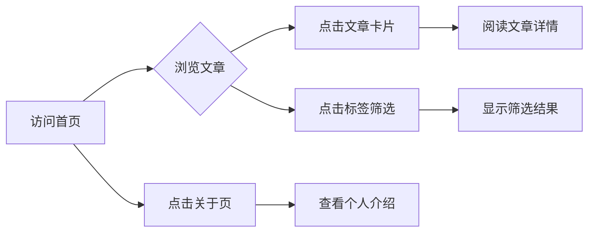

# 个人博客产品需求文档 (PRD)

## 1. Product Overview
为用户构建一个优雅、极简风格的个人博客网站，参考 poetize.cn 的文学气息设计。通过 GitHub Pages 部署，支持自定义域名 zoefeng.qzz.io 访问。

- **主要目的**: 展示个人文章、作品集、生活随笔，建立个人品牌
- **目标用户**: 个人读者、朋友、潜在合作伙伴
- **核心价值**: 打造一个有独特设计风格的个人数字空间

## 2. Core Features

### 2.1 User Roles
此项目为个人静态博客，无需用户角色系统。

### 2.2 Feature Module
1. **首页**: Hero 展示区、文章列表、个人简介
2. **文章详情页**: 文章内容展示、目录导航、返回首页
3. **关于页**: 个人介绍、技术栈、联系方式

### 2.3 Page Details
| Page Name | Module Name | Feature description |
|-----------|-------------|---------------------|
| 首页 | Hero 展示区 | 个人头像、名字、一句座右铭、优雅的背景动效 |
| 首页 | 文章列表 | 卡片式展示、按时间排序、标签分类、悬停效果 |
| 首页 | 页脚 | 社交链接、版权信息 |
| 文章详情页 | 文章内容 | Markdown 渲染、代码高亮、阅读进度指示 |
| 文章详情页 | 目录导航 | 侧边目录、滚动高亮、快速跳转 |
| 文章详情页 | 返回按钮 | 优雅的返回首页按钮 |
| 关于页 | 个人简介 | 头像、个人介绍、时间线/经历展示 |
| 关于页 | 技术栈 | 技术标签、技能展示 |
| 关于页 | 联系方式 | 邮箱、GitHub、社交平台链接 |

## 3. Core Process

用户访问流程：
1. 访问 zoefeng.qzz.io → 加载首页 → 浏览文章列表
2. 点击文章卡片 → 进入文章详情页 → 阅读文章
3. 点击导航"关于" → 查看个人介绍
4. 点击标签 → 筛选同类文章

## 4. User Interface Design

### 4.1 Design Style
参考 poetize.cn 的文学、优雅、极简风格：

- **主色调**: 米白色/奶油色背景 (#FAF9F6)，深色文字 (#2C2C2C)，温润的棕色/赭石色强调 (#8B6914)
- **字体**: 使用优雅的衬线字体组合，标题使用衬线体，正文使用易读的无衬线体
- **按钮样式**: 圆角、极简、悬停时的微妙颜色变化
- **布局风格**: 大量留白、居中布局、卡片式设计、优雅的分隔线
- **动效**: 平滑的页面过渡、滚动渐显、微妙的悬停效果

### 4.2 Page Design Overview

| Page Name | Module Name | UI Elements |
|-----------|-------------|-------------|
| 首页 | Hero 展示区 | 居中对齐、优雅的标题字体、细腻的背景纹理、淡入动画 |
| 首页 | 文章列表 | 卡片式布局、悬停上浮效果、时间与标签信息、优雅的分隔线 |
| 首页 | 页脚 | 简洁的分隔线、图标链接、灰色调、固定底部 |
| 文章详情页 | 文章内容 | 清晰的标题层级、舒适的行高、代码块样式、图片居中 |
| 文章详情页 | 目录导航 | 固定侧边、滚动高亮、折叠/展开、淡入显示 |
| 关于页 | 时间线 | 优雅的垂直线、圆点标记、年份标注、内容卡片 |
| 关于页 | 技术标签 | 圆角标签、随机淡色背景、悬停高亮 |

### 4.3 Responsiveness
- **Desktop-first**: 桌面端优先设计
- **断点**: 1024px (平板), 768px (手机)
- **移动端优化**: 
  - 单栏布局
  - 汉堡菜单导航
  - 侧边目录转为顶部目录
  - 触摸友好的点击区域
  - 适当缩小字号和间距

### 4.4 设计亮点
- 参考 poetize.cn 的"新中式"文学气息
- 使用细线、优雅的排版创造高级感
- 柔和的阴影和微妙的动效
- 专注于阅读体验，减少视觉干扰
- 留白与内容的黄金比例
