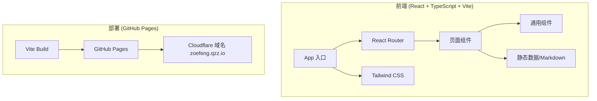

# 个人博客技术架构文档

## 1. Architecture Design



## 2. Technology Description

- **前端框架**: React@18 + TypeScript@5
- **构建工具**: Vite@5
- **样式方案**: Tailwind CSS@3
- **路由管理**: React Router DOM@6
- **图标库**: Lucide React
- **Markdown 渲染**: react-markdown + remark-gfm
- **代码高亮**: react-syntax-highlighter
- **部署方式**: GitHub Pages (gh-pages 分支)
- **后端服务**: 无 (纯静态站点)
- **数据库**: 无 (使用静态 JSON/Markdown 文件存储文章)

## 3. Route Definitions

| Route | Page | Purpose |
|-------|------|---------|
| `/` | HomePage | 首页 - Hero 区 + 文章列表 |
| `/post/:slug` | PostPage | 文章详情页 |
| `/about` | AboutPage | 关于页 - 个人介绍 |
| `/tag/:tag` | HomePage | 标签筛选 |

## 4. 项目结构

```
personal-blog/
├── src/
│   ├── components/          # 通用组件
│   │   ├── Header.tsx       # 头部导航
│   │   ├── Footer.tsx       # 页脚
│   │   ├── PostCard.tsx     # 文章卡片
│   │   ├── TagBadge.tsx     # 标签徽章
│   │   ├── TableOfContents.tsx  # 目录导航
│   │   └── Timeline.tsx     # 时间线组件
│   ├── pages/               # 页面组件
│   │   ├── HomePage.tsx     # 首页
│   │   ├── PostPage.tsx     # 文章详情页
│   │   └── AboutPage.tsx    # 关于页
│   ├── data/                # 静态数据
│   │   ├── posts.json       # 文章元数据
│   │   └── posts/           # Markdown 文章
│   │       ├── post1.md
│   │       └── post2.md
│   ├── utils/               # 工具函数
│   │   └── markdown.ts      # Markdown 处理工具
│   ├── styles/              # 全局样式
│   │   └── globals.css
│   ├── App.tsx
│   ├── main.tsx
│   └── vite-env.d.ts
├── public/
│   └── CNAME                # 自定义域名配置
├── index.html
├── package.json
├── tsconfig.json
├── vite.config.ts
└── tailwind.config.js
```

## 5. 数据模型

### 5.1 文章数据结构 (posts.json)

```typescript
interface Post {
  slug: string;           // 文章标识/URL路径
  title: string;          // 标题
  excerpt: string;        // 摘要
  date: string;           // 发布日期 (YYYY-MM-DD)
  tags: string[];         // 标签
  coverImage?: string;    // 封面图 (可选)
  readTime: number;       // 阅读时间 (分钟)
  fileName: string;       // 对应的 Markdown 文件名
}
```

### 5.2 Markdown 文章格式

```markdown
---
slug: my-first-post
title: 我的第一篇文章
excerpt: 这是一篇示例文章的摘要
date: 2024-01-15
tags: [生活, 随笔]
readTime: 5
---

# 文章标题

文章正文内容...
```

## 6. 构建与部署

### 6.1 构建配置 (vite.config.ts)

```typescript
export default defineConfig({
  plugins: [react()],
  base: '/',  // 使用自定义域名时设为 '/'
})
```

### 6.2 GitHub Pages 部署流程

1. **构建**: `npm run build` 生成 `dist` 目录
2. **部署**: 使用 `gh-pages` 工具将 `dist` 目录推送到 `gh-pages` 分支
3. **域名配置**: 在仓库根目录添加 `CNAME` 文件，内容为 `zoefeng.qzz.io`
4. **Cloudflare 配置**: DNS CNAME 指向 `zhang-loiu.github.io`

### 6.3 package.json 脚本

```json
{
  "scripts": {
    "dev": "vite",
    "build": "vite build",
    "preview": "vite preview",
    "deploy": "gh-pages -d dist"
  }
}
```

## 7. 性能与SEO

- **预加载**: 关键资源预加载
- **懒加载**: 图片懒加载
- **响应式图片**: srcset 适配不同设备
- **SEO**: 动态更新页面标题和 meta 描述
- **无障碍**: 语义化 HTML、ARIA 标签、键盘导航

## 8. 注意事项

1. **静态路由**: GitHub Pages 上 SPA 路由需要处理 404 重定向
2. **图片资源**: 使用 GitHub CDN 或外部图床
3. **文章管理**: 通过 Git 提交新的 Markdown 文件更新文章
4. **本地开发**: `npm run dev` 启动本地服务器预览
